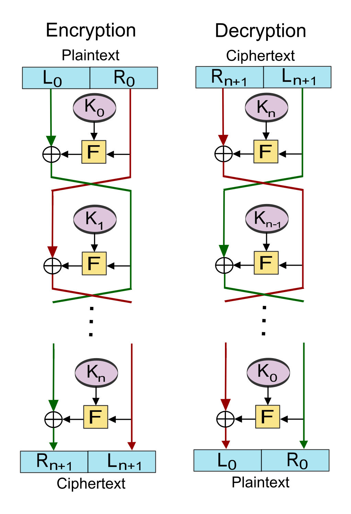

# Swift Feistel Cipher
My attempt at implementing a Feistel Cipher completely in Swift 

# Background

"In cryptography, a Feistel cipher is a symmetric structure used in the construction of block ciphers, named after the German-born physicist and cryptographer Horst Feistel who did pioneering research while working for IBM (USA); it is also commonly known as a Feistel network. A large proportion of block ciphers use the scheme, including the Data Encryption Standard (DES). The Feistel structure has the advantage that encryption and decryption operations are very similar, even identical in some cases, requiring only a reversal of the key schedule. Therefore, the size of the code or circuitry required to implement such a cipher is nearly halved." (Wikipedia)

# Installation
- Add to your podfile `pod 'Feistel'`

# Usage
1. Create a `Feistel` object using the `shared` property. 
    - `let fest = Feistel.shared`
2. Set the number of passes you would like to take for both decrpyt and encrypt. It defaults to `5`.
    - `fest.passes = 10`
2. Create the `Data` object you would like to encrypt.
    - `let data = "super duper awesome test".data(using: .utf8)`
    - It can work with images too! Really anything that can be converted to `Data`
3. To encrypt:
    - `let encrypted = fest.encrypt(data: data)`
4. To decrypt (using already encrypted data): 
    - `let decrypt = fest.decrypt(data: encrypted)`
5. The keys used in the cipher are unique per instance session. You can retrieve the keys used in the cipher by calling: 
    - `fest.keys()`

# Resources 
- Feistel Cipher - Computerphile: https://www.youtube.com/watch?v=FGhj3CGxl8I
- Feistel cipher - https://en.wikipedia.org/wiki/Feistel_cipher
